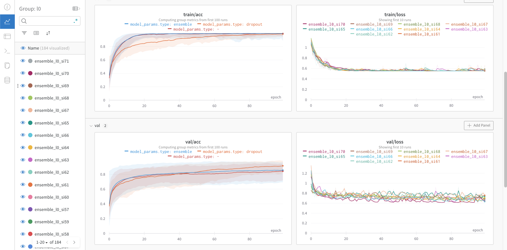
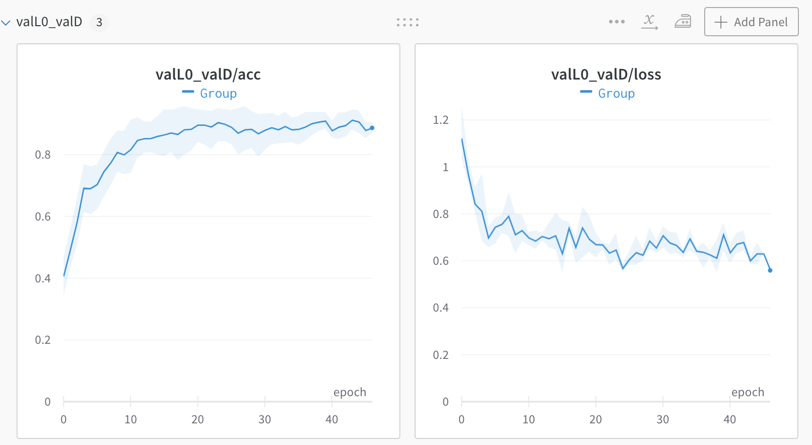
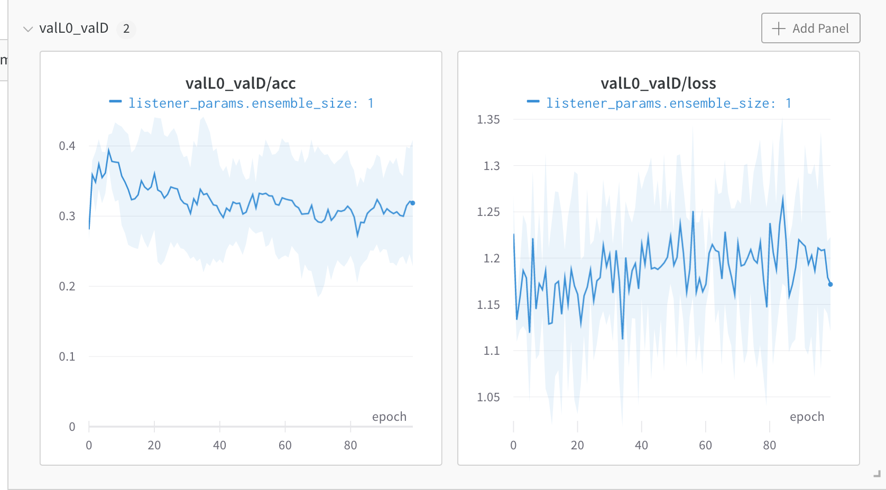
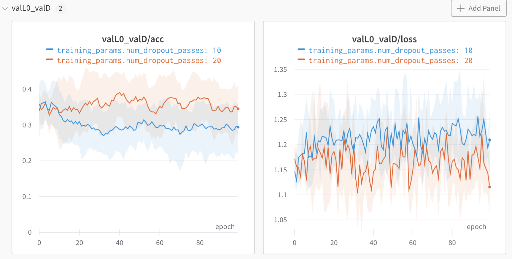

# Calibrate your listeners! Robust communication-based training for pragmatic speakers
[[Paper]](https://arxiv.org/pdf/2110.05422.pdf) [[Short Video]](https://www.youtube.com/watch?v=3VKU9ueVTMo&ab_channel=RoseWang) [[Long Video]](https://www.youtube.com/watch?v=XibugeVHzzM&t=2s)


NOTE: This should be run with python3.8


Rose E. Wang, Julia White, Jesse Mu, Noah D. Goodman

Findings of EMNLP 2021

Contents:
- [Introduction](#introduction)
- [Installation](#installation)
- [Replication](#replication)
    - [Training the listener(s)](#listener)   
    - [Training the speaker](#speaker) 
- [Checkpoints](#checkpoints)

## Introduction
To be good conversational partners, natural language processing (NLP) systems should be trained to produce contextually useful utterances. Prior work has investigated training NLP systems with communication-based objectives, where a neural listener stands in as a communication partner. However, these systems commonly suffer from semantic drift where the learned language diverges radically from natural language. We propose a method that uses a population of neural listeners to regularize speaker training. We first show that language drift originates from the poor uncertainty calibration of a neural listener, which makes high-certainty predictions on novel sentences. We explore ensemble- and dropout-based populations of listeners and find that the former results in better uncertainty quantification. We evaluate both population-based objectives on reference games, and show that the ensemble method with better calibration enables the speaker to generate pragmatic utterances while scaling to a large vocabulary and generalizing to new games and listeners.


## Installation
Two steps before running experiments:
1. Install the required libraries with `pip install -e .`
2. In `calibrate_your_listeners/constants.py`, change the directory paths to map to your local path. 

This work uses [Weights and Biases](https://wandb.ai/) for reporting all the results. Make sure to set up an account (it's easy!) and login (this is also easy - just run `wandb login` in your terminal). 

The two-line instructions can also be found [here](https://docs.wandb.ai/quickstart#1.-set-up-wandb).


## Replication
**NOTE 1: All of the commands for replicating this work are summarized in `calibrate_your_listeners/scripsts/commands.sh`**. Below, I'll describe these commands in more detail. 


**NOTE 2: This repository already contains pretrained listener models; you can jump to 'Training the speaker' if you don't want to train the listeners from scratch.**


There are two training stages in this work. The first is training the _listener(s)_, and the second is training the _speaker_.

### Training the listener(s)

Our work uses the following four listeners.  

* `single-L0` with small token space: A listener that's trained on the domain-specific token space. Our work uses the ShapeWorld domain which contains 15 tokens.

To train:  `python scripts/run.py --config-name=l0 wandb_params.dryrun=False`

* `single-L0` with large token space: A listener that's trained on a large token space. Our work uses GPT2's token space.

To train:  `python scripts/run.py --config-name=l0 model_params.vocab=gpt2 wandb_params.dryrun=False`

* `dropout-based L0`: A listener with dropout trained on a large token space.

To train:  `python scripts/run.py --config-name=l0 model_params.type=dropout model_params.dropout_rate=0.1 model_params.vocab=gpt2 wandb_params.dryrun=False`

* `population-based L0`: An ensemble of listeners trained on a large token space.

To train: 
```
ensemble_size=15
for idx in $(seq 1 1 $ensemble_size); do
    python scripts/run.py --config-name=l0 model_params.listener_idx='${idx}' model_params.vocab=gpt2 model_params.type=ensemble wandb_params.dryrun=False
done
```

#### Visualizations

Each experiment automatically logs the results (accuracy & loss on train & test) to Weights and Biases. 
It should look something like this: 


### Training the speaker 

Our works trains the speaker with each of the four listeners. 

To train the speaker with...

* `single-L0`: Run `python scripts/run.py --config-name=s1 wandb_params.dryrun=False wandb_params.exp_name=s1_small_vocab`

The speaker should generalize well in the small vocabulary domain. 

The result should look something like this:



* `single-L0`: Run `python scripts/run.py --config-name=s1 wandb_params.dryrun=False listener_params.type=ensemble model_params.vocab=gpt listener_params.ensemble_size=1`

The speaker should overfit in this setting.

The result should look something like this:



* `dropout-based L0` with `<x>` number of MC passes: Run `python scripts/run.py --config-name=s1 wandb_params.dryrun=False listener_params.type=dropout model_params.vocab=gpt model_params.dropout_rate=0.1 training_params.num_dropout_passes=<x>` 

The speaker should overfit in this setting.

The result should look something like this:



* `population-based L0` with `<x>` number of listeners in the ensemble: Run `python scripts/run.py --config-name=s1 wandb_params.dryrun=False wandb_params.exp_name=s1_ensemble_update listener_params.type=ensemble model_params.vocab=gpt  listener_params.ensemble_size=<x>`

The speaker should generalize in this setting. 

The result should look something like this:


